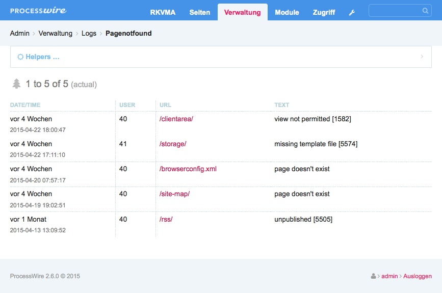

PROCESS 404 LOGGER
===================

Creates a logfile 'pagenotfound' and logs all requests resulting in http error 404.  

## Screenshot

## License
[GNU-GPLv3](http://www.gnu.org/licenses/gpl-3.0.html)

## Author
kixe (Christoph Thelen)